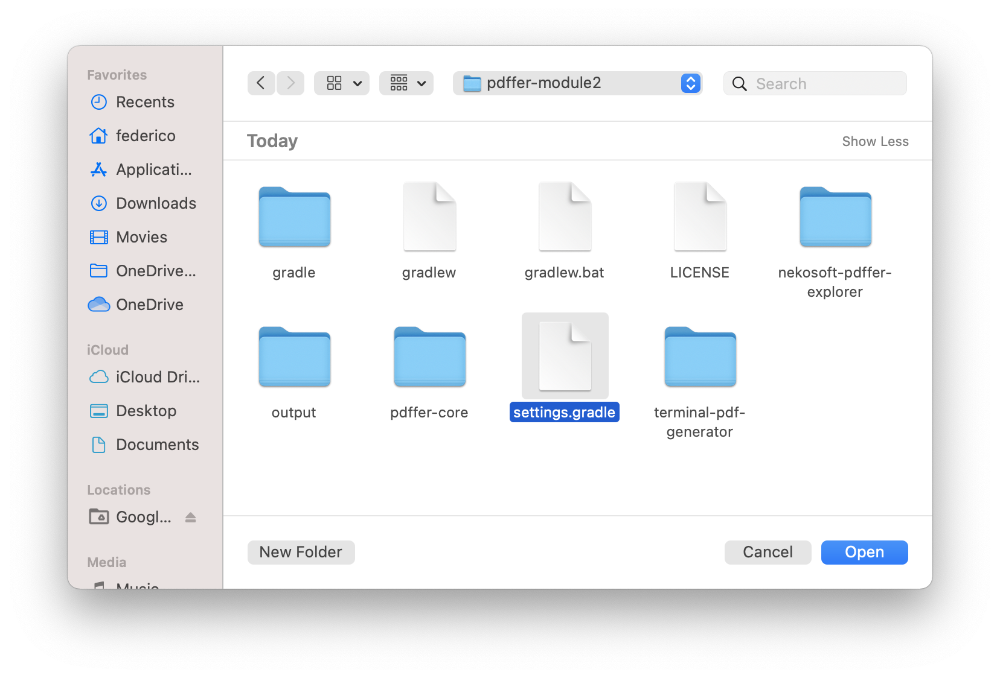
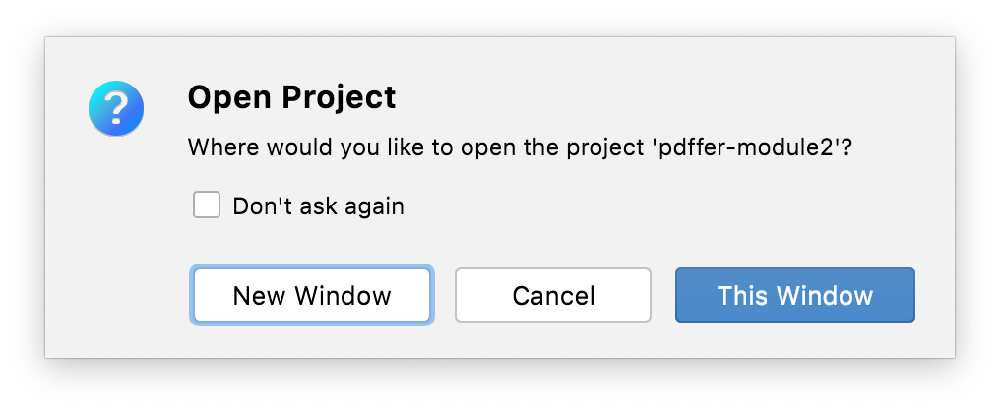

## Pluralsight Exercise Files

If you are following my Spring Boot course on Pluralsight
  [Spring Boot: Effective Development, Configuration and Deployment](https://app.pluralsight.com/library/courses/spring-boot-development-configuration-deployment/),
  it is important that you try as much as possible to follow the lectures 
  and demos while keeping the corresponding code open in your IDE, ready for
  you to play with and experiment. This is very important because I do not know of any other 
  way to become a good programmer than by actually programming.

This page explains how to set up the course exercise files in Eclipse with Spring Tools 4 and in IntelliJ
  Ultimate so that you have everything ready to follow along during lectures and demos.  

The exercise files in the course provide configuration for two build tools: Maven and Gradle.

Personally, I have used Maven with Eclipse and
  Gradle with IntelliJ Ultimate 2021.2. However, it really does not matter,
  they should all work in either IDE and with different versions too, so feel
  free to use the build tool you want with the IDE you want!

Eclipse with Maven
------------------

In order to use the Maven files with Eclipse STS 4, follow these simple steps:

1. Create a new workspace

2. Open the import wizard to add projects from folder or archive

3. Click on the _Archive..._ button and select the ZIP file for the module
   you are about to study. This will present a choice of 4 possible projects.
   Only choose the ones that can be imported as _Maven_ projects.

4. You projects will be imported and built. As soon as all background jobs
   are completed, you are ready to start following the lectures and demos in
   the Pluralsight module!

IntelliJ with Gradle
--------------------

The Gradle projects are all contained inside of a root Gradle project
represented by the top-level `settings.gradle` file.

In order to use the Gradle files with IntelliJ, first of all extract the ZIP
file for the module you are about to study where you want the project to be.

Then simply follow these steps

1. Create a new _Project from Existing Sources..._

2. Select the `settings.gradle` file from the unzipped course files

3. If it asks, you can trust this project

4. If you want to keep the project you were working on before open, then
   choose _New Window_, otherwise choose _This Window_ and your previous project
   will be closed to make room for this new one

5. If you get this little pop-up in the bottom-right corner, choose to _Use Services_
   so your boot application will be listed in the _Services_ view

6. You projects will be imported and built. As soon as all background jobs
   are completed, you are ready to start following the lectures and demos in
   the Pluralsight module!

